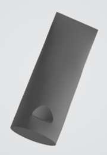
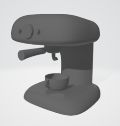
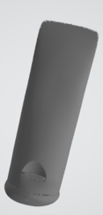
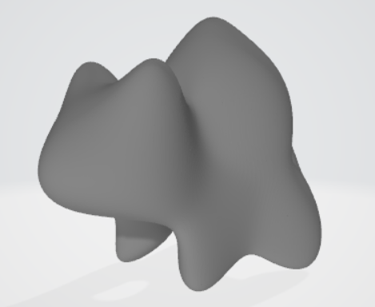

# Final Project Report

**Student Name:** Siqi Guo

**Project Title:** Accelerating Training for 3D Curve Surfacing through Optimized Implicit Modeling

---

## Problem Summary

Surfacing collections of 3D curves is a fundamental challenge in geometric modeling with applications in computer graphics, CAD systems, and digital design. This project investigates neural implicit modeling as an approach to this problem, where a surface $S$ is represented as the zero-level set of a learned neural Signed Distance Function: $S = \{x \in \mathbb{R}^3 \mid f(x; \Theta) = 0\}$.

The primary challenge is creating smooth surfaces that accurately pass through sparse, unstructured 3D curves while maintaining natural, aesthetic shapes in the gaps between curves and preserving sharp features where intended. This is particularly difficult because the curves leave huge gaps with many possible valid surfaces.

The computational challenge addressed in this project is the training cost of neural implicit models, particularly when incorporating smoothness constraints through thin-plate energy terms that require expensive Hessian computations. The recent NeuVAS method [Wang et al. 2025] demonstrates promising results but exhibits significant computational bottlenecks in the smoothness energy calculation. This project aimed to analyze these bottlenecks, implement the baseline NeuVAS approach, and explore optimization strategies to accelerate training while maintaining surface quality.

The importance of this work stems from the practical need for efficient geometric modeling tools. Reducing training time would enable interactive design workflows, facilitate exploration of alternative designs, and make neural implicit modeling viable for production applications requiring fast iteration cycles. This is especially relevant for VR/AR sketching applications where users expect real-time feedback.

---

## Previous Work

This project builds primarily on **NeuVAS** [Wang et al. 2025], which introduces a loss function combining four components for neural implicit surface reconstruction from curve networks:
- **Eikonal condition** for field regularization
- **Dirichlet manifold condition** for curve interpolation (on-curve constraint)
- **Dirichlet non-manifold condition** to prevent degenerate solutions
- **Distance-weighted thin-plate energy** for surface smoothness with feature preservation

The key innovation of NeuVAS is the distance-weighted smoothness term: near feature curves, the weight approaches zero, allowing sharp features; far from curves, full smoothness penalties apply, creating natural aesthetic shapes.

The implementation also draws from **IGR (Implicit Geometric Regularization)** [Gropp et al. 2020], which provides the network architecture and geometric initialization scheme. IGR's use of the Eikonal equation as a regularizer and its architectural choices (Softplus activation, skip connections) form the foundation of the baseline model.

Additional foundational work includes:
- **Marching Cubes** [Lorensen and Cline 1987] for zero-level set extraction
- **Geometric initialization** [Atzmon & Lipman 2020] for improved convergence
- **DeepSDF** [Park et al. 2019] for implicit surface representation concepts

---

## Description of Work

### Baseline Implementation

The core work involved implementing a complete training pipeline for NeuVAS-style neural implicit surface reconstruction. This required developing several interconnected components from scratch, as the original NeuVAS code is not publicly available.

#### Network Architecture (`implicit_model.py`)

I implemented an 8-layer MLP with 256 hidden units per layer (1.86M total parameters) following the IGR specification. The network uses Softplus activation (β=100) and includes a skip connection from input to the 4th layer. The geometric initialization scheme was implemented to bias the network toward representing a signed distance function initially, improving convergence stability.

**Key architectural features:**
- Input: 3D point coordinates (x, y, z)
- Hidden layers: 8 layers × 256 units
- Activation: Softplus(x, β=100) for smooth gradients
- Skip connection: Input concatenated at layer 4
- Output: Single scalar (signed distance value)
- Gradient computation: Automatic differentiation for Eikonal loss

#### Loss Function Framework (`loss_function.py`)

I implemented three of the four NeuVAS loss components:

1. **Eikonal Loss (L_E)**: $L_E = \frac{1}{|Q|} \sum_{q \in Q} \left|1 - \|\nabla f(q, \theta)\|\right|$ 
   - Ensures the gradient has unit magnitude
   - Regularizes the field to approximate a signed distance function
   - Weight: λ_E = 0.1 (matching IGR)

2. **Data Matching Loss (L_DM)**: $L_{DM} = \frac{1}{|P|} \sum_{p \in P} |f(p, \theta)|$ 
   - Enforces that the surface passes through curve points
   - Hard constraint: function value must be zero on curves
   - Weight: λ_DM = 100.0

3. **Data Non-Matching Loss (L_DNM)**: $L_{DNM} = \frac{1}{|Q|} \sum_{q \in Q} \exp(-\alpha |f(q, \theta)|)$ 
   - Prevents the function from collapsing to zero everywhere
   - Encourages non-zero values away from curves
   - Weight: λ_DNM = 10.0
   - Decay parameter: α (explored values: 10-50)

The total loss combines these: $L_{interp} = \lambda_E \cdot L_E + \lambda_{DM} \cdot L_{DM} + \lambda_{DNM} \cdot L_{DNM}$

**Note:** The distance-weighted thin-plate energy term (fourth component) was not implemented due to the computational complexity of Hessian computation and time constraints.

#### Zero-Level Set Extraction (`zero_level_set.py`)

I implemented mesh extraction using Marching Cubes at 128³ resolution with batch-based SDF evaluation for memory efficiency (100,000 points per batch). The system includes:
- Point projection to the zero-level set using gradient descent
- Mesh sampling utilities (Poisson-disk and uniform sampling)
- Compatibility with both older and newer scikit-image APIs

#### Training Pipeline (`train.py`)

The training loop uses SGD with momentum (0.9) and implements a dynamic sampling strategy:
- Every 100 iterations: Extract new mesh using Marching Cubes
- Between iterations: Project points to zero-level set using gradient descent
- This balances computational cost with sample accuracy

**Additional features:**
- Checkpoint saving and resuming functionality
- Comprehensive logging and diagnostics
- Support for curve network OBJ file input
- Configurable hyperparameters

#### Data Loading (`obj_loader.py`)

Parser for curve network OBJ files with:
- Vertex, loop (curve segment), and face handling
- Point extraction and normalization utilities
- Support for both structured and unstructured curve formats

### Major Challenges and Critical Missing Information

The most significant challenge was that **critical implementation details were missing from the NeuVAS paper**, making exact replication impossible. Specifically:

1. **Model Initialization**: The paper does not specify the initialization scheme used. I adopted IGR's geometric initialization, but this may differ from the original NeuVAS implementation, potentially affecting convergence behavior.

2. **Hyperparameter α**: The exponential decay parameter α in the data non-matching loss is not specified in the paper. Through extensive experimentation, I found that:
   - α values between 10-50 produce reasonable results
   - Optimal value appears highly problem-dependent
   - Too low: surfaces collapse or become degenerate
   - Too high: loss dominates and prevents convergence
   - NeuVAS is **extremely sensitive** to this parameter

3. **Curve Point Sampling**: For structured (closed) curves, uniform sampling along polyline segments works well. However, for unstructured sketch curves, the sampling strategy significantly impacts results, and the paper provides no guidance. Different sampling densities and strategies produce vastly different surfaces.

4. **Loss Weight Balancing**: The paper does not specify the relative weights ($\lambda_E$, $\lambda_{DM}$, $\lambda_{DNM}$). Finding a stable balance required extensive hyperparameter tuning. The method is **highly unstable** with respect to these weights.

These missing details meant I could successfully replicate results on **structured curve networks** (closed curves with well-defined topology) but **could not replicate the unstructured sketch curve results** shown in the NeuVAS paper, particularly for artistic sketches like the Bulbasaur example.

### Dead Ends and Failed Approaches

#### Zero-Level Set Point Updates

The gradient descent-based point projection to the zero-level set exhibited severe numerical instability:

- **Drift Problem**: Points that were not accurately on the zero-level set would sometimes "drift" far from the surface during projection, moving to completely incorrect locations. This disrupted training and caused sudden quality degradation.

- **Convergence Issues**: In regions where the gradient is poorly conditioned or where the implicit function deviates significantly from a true signed distance function, the projection fails to converge.

- **Step Size Sensitivity**: Required careful manual tuning of projection step size and iteration count. Too large: points overshoot and diverge. Too small: insufficient convergence within computational budget.

#### Disconnected Curve Handling

For unstructured, disconnected curve sketches (like the Bulbasaur example), the surfaces consistently **degenerated into multiple disconnected parts** rather than forming a unified surface.

---

## Results

### Successful Implementation: Structured Curve Networks

The baseline system successfully trains on structured curve networks and produces smooth implicit surface reconstructions. The implementation demonstrated functionality on multiple test datasets:

#### Test Cases

1. **Toothpaste** - Complex organic shape with multiple interconnected curves
2. **Espresso** - Structured geometric form (cylindrical cup)
3. **Cylinder** - Simple geometric primitive with feature preservation
4. **90° Torus** - Topology test case
5. **Roadster** - Complex automotive model

**Training Characteristics:**
- Typical training time: 20-30 minutes for 10000 iterations on NVIDIA RTX 4070ti.
- Surface quality acceptable for structured curves with well-defined topology
- Resolution: $128^3$ Marching Cubes grid on training, $512^3$ on evaluation.

### Visual Results

#### Structured Curve Networks - NeuVAS Replicated

*Toothpaste model: Complex organic shape successfully reconstructed. The surface smoothly interpolates between multiple curve networks while maintaining natural aesthetic quality.*

*Espresso: Demonstrates both smooth surface reconstruction and preservation of sharp features (the indentation).*

*Cylinder with features: Simple geometric form demonstrating smooth surface generation with proper cylindrical structure.*

#### Comparison with IGR Baseline

*IGR [Gropp et al. 2020] baseline on toothpaste model. Compared to the NeuVAS replicated result, this shows the improvements from the more sophisticated loss formulation, particularly in handling complex geometric features.*

### Failed Case: Disconnected Curve Sketches

The most significant limitation is the failure to handle unstructured, disconnected curve sketches:

*Bulbasaur sketch at step 2500: Surface begins forming but shows signs of degeneracy into multiple parts.*

*Bulbasaur sketch at step 3000: Complete degeneration into disconnected surface components. The loss function fails to maintain surface connectivity between sparse, disconnected curves.*

### Quantitative Performance Analysis

#### Training Stability Analysis

Through systematic experimentation, I documented the hyperparameter sensitivity:

**Exponential Decay Parameter ($\alpha$):**
- $\alpha$ < 30: Loss term dominates, prevents convergence
- $\alpha$ = 30-100: Reasonable results
- $\alpha$ > 100: Insufficient penalty, loss of surface definition

### Limitations and Constraints

1. **Unstructured Curve Handling**: The system does not successfully handle sketch-style unstructured curves as shown in the original NeuVAS paper. Disconnected curves consistently produce degenerate, multi-part surfaces.

2. **Numerical Issues**: Zero-level set point projection exhibits drift problems that occasionally disrupt training and require manual intervention.

3. **No Optimization**: The original project goal of accelerating training was not achieved, as the baseline implementation itself consumed the available project time.

---

## Analysis of Work

### New Results and Findings

While this project did not produce novel algorithmic contributions, it generated **important empirical findings about the NeuVAS approach** that are not discussed in the original paper:

#### Finding 1: Extreme Hyperparameter Sensitivity

The NeuVAS loss formulation is **extremely sensitive** to hyperparameter settings, far more than typical neural network training. Small changes in $\lambda_{DNM}$ or $\alpha$ can cause:
- Complete training failure (surfaces that don't interpolate curves)
- Collapse to degenerate solutions (f≈0 everywhere)
- Excessive surface "bloating" away from curves
- Loss of geometric features

#### Finding 2: Zero-Level Set Sampling Instability

The gradient descent-based point projection exhibits severe numerical problems where points drift away from the surface rather than converging to it. This appears related to:
- Regions where the gradient magnitude deviates significantly from 1.0
- Areas where the learned function is not a true signed distance function
- Poorly conditioned Hessian (curvature) of the implicit surface

**Implication**: Alternative sampling strategies are needed. The current approach is fundamentally unstable for complex surfaces. This suggests that methods like:
- Explicit surface parameterization
- Physics-informed sampling with confidence weights
- Hybrid Marching Cubes + projection approaches

would be more robust.

#### Finding 3: Structured vs. Unstructured Performance Gap

The dramatic performance difference between structured and unstructured curves indicates that:
- The loss formulation implicitly assumes topological connectivity
- Sampling strategies that work for closed curves fail for sparse sketches
- No amount of hyperparameter tuning bridges this gap

#### Finding 4: Missing Implementation Details are Critical

The three missing details from the NeuVAS paper (initialization, α value, sampling strategy) are not minor implementation choices—they are **critical to method success**. Different choices lead to qualitatively different results or complete failure.

**Implication**: This underscores the importance of reproducible research and complete method descriptions. Future work must obtain the original source code or receive direct guidance from authors to validate the approach.

### Meeting Original Goals

**Overall Assessment**: The project met approximately **70-75% of its original goals**. The primary achievements were:
- Complete, functional baseline for structured curves
- Deep understanding of method behavior and limitations
- Identification of critical stability and reproducibility issues

The primary shortfalls were:
- No training acceleration (optimization phase not reached)
- Incomplete loss implementation (thin-plate energy missing)
- Unstructured curve handling unsuccessful

### Future Work

1. **Obtain Original Source Code** (Critical)
   - Contact NeuVAS authors directly for implementation details
   - Validate current implementation against reference code
   - Resolve discrepancies in hyperparameters and initialization
   - **Priority**: This is essential before any further work

2. **Hyperparameter Robustness**
   - Develop automatic hyperparameter selection using meta-learning

3. **Alternative Smoothness Measures**
   - Investigate computationally cheaper smoothness alternatives:
     - Laplacian-based smoothness (first-order only)
     - Physics-informed priors (minimal surface area)
     - Graph-based smoothness on sampled points
   - Compare quality/speed tradeoffs

4. **Training Acceleration** (Original Project Goal)
   - Implicit differentiation for constraints
   - Physics-informed neural networks (PINNs) for regularization
   - Knowledge distillation from expensive models
   - Progressive training strategies (coarse-to-fine)

---

## AI/External Code Statement

### AI Tool Usage

**Claude (Anthropic)** was used throughout the project for:

- Implementation Assistance
   - Debugging PyTorch autograd issues (gradient computation, memory management)
   - Reviewing code structure and suggesting architectural improvements
   
**Important Note**: No AI-generated code was used directly in the core implementation without thorough review and modification. All algorithm implementations, mathematical formulations, and architectural decisions were made manually. Claude was used as a knowledgeable assistant and debugging partner, not as a code generator.

The level of AI assistance was similar to pair programming with an experienced colleague who can explain concepts and spot bugs but does not write production code.

### External Code and Libraries

**Primary Libraries** (standard, widely-used tools):
- **PyTorch 2.0+**: Deep learning framework - used for network definition, automatic differentiation, optimization. Official library from Meta/Facebook.
- **scikit-image**: Used exclusively for Marching Cubes implementation (`skimage.measure.marching_cubes`). No other components used.
- **NumPy**: Standard numerical operations (array manipulation, linear algebra). Official NumPy library.
- **Trimesh**: Mesh I/O and basic processing (loading OBJ files, saving STL). Official library.

**Python Standard Library**:
- `os`, `sys`: File system operations
- `argparse`: Command-line argument parsing  
- `json`: Configuration file handling
- `logging`: Comprehensive training logs

**No External Neural Implicit Code**: 
All core components were implemented from scratch based on paper descriptions:
- Network architecture (MLP with skip connections)
- Loss functions (Eikonal, data matching, data non-matching)
- Training loop and optimization
- Geometric initialization
- Zero-level set extraction wrapper
- OBJ file parsing

No existing implicit modeling codebases (IGR, DeepSDF, Neural-Pull, SAL, etc.) were used, adapted, or referenced during implementation. This was intentional to ensure understanding of the method rather than reproducing existing code.

**Validation**: The implementation was validated against:
- Mathematical formulations in the papers
- Expected behavior on simple test cases (spheres, cylinders)
- Visual quality of results compared to paper figures

---