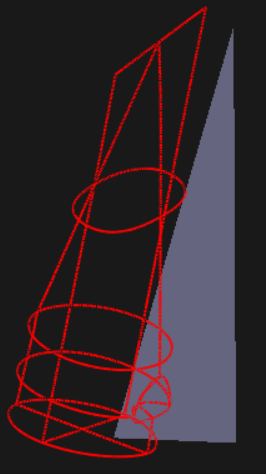
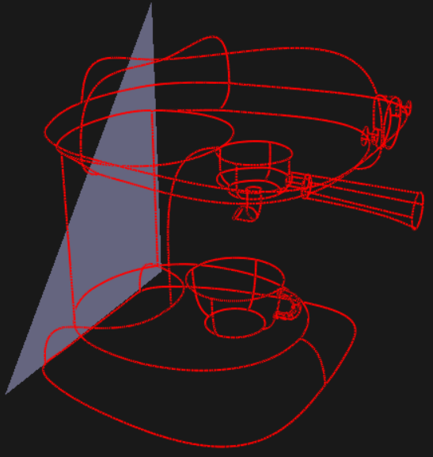

# Second Project Update

**Student Name:** Siqi Guo

**Project Title:** Accelerating Training for 3D Curve Surfacing through Optimized Implicit Modeling

## Summary of Work to Date

### Baseline Implementation (Completed)

I have completed a fully functional baseline training pipeline for neural implicit surface reconstruction from curve networks. The implementation is based on the IGR (Implicit Geometric Regularization) architecture [Gropp et al. 2020], which provides a solid foundation for implicit surface modeling.

**Core Components Implemented:**

1. **Neural Network Architecture** (`implicit_model.py`):
   - 8-layer MLP with 256 hidden units per layer (1.86M parameters)
   - Softplus activation (β=100) as per IGR specification
   - Geometric initialization following Atzmon & Lipman [2020]
   - Skip connection from input to middle layer (4th layer) with proper normalization
   - Gradient computation function for Eikonal loss

2. **Loss Function Framework** (`loss_function.py`):
   - **Eikonal Loss ($L_E$)**: NeuVAS-style formulation using absolute value:
     $$L_E = \frac{1}{|Q|} \sum_{q \in Q} \left|1 - \|\nabla f(q, \theta)\|\right|$$
   - **Data Matching Loss ($L_{DM}$)**: Ensures surface passes through curve points:
     $$L_{DM} = \frac{1}{|P|} \sum_{p \in P} |f(p, \theta)|$$
   - **Data Non-Matching Loss ($L_{DNM}$)**: Prevents function from being zero away from curves:
     $$L_{DNM} = \frac{1}{|Q|} \sum_{q \in Q} \exp(-\alpha |f(q, \theta)|)$$
   - **Total loss**:
     $$L_{interp} = \lambda_E \cdot L_E + \lambda_{DM} \cdot L_{DM} + \lambda_{DNM} \cdot L_{DNM}$$
   - Default hyperparameters: $\lambda_E = 0.1$ (matching IGR), $\lambda_{DM} = 100.0$, $\lambda_{DNM} = 10.0$, $\alpha = 10.0$

3. **Zero-Level Set Extraction** (`zero_level_set.py`):
   - Marching Cubes implementation at $128^3$ resolution
   - Batch-based SDF evaluation for memory efficiency (100,000 points per batch)
   - Point projection to zero-level set using gradient descent
   - Mesh sampling utilities (Poisson-disk and uniform sampling)
   - Compatible with both older (`marching_cubes_lewiner`) and newer (`marching_cubes`) scikit-image APIs

4. **Training Pipeline** (`train.py`):
   - SGD optimizer with momentum (0.9)
   - Zero-level set sampling strategy: extracts mesh every 100 iterations using Marching Cubes, projects points in between iterations
   - Checkpoint saving and resuming functionality
   - Comprehensive logging and diagnostics
   - Support for curve network OBJ file input

5. **Data Loading** (`obj_loader.py`):
   - Parser for curve network OBJ files
   - Handles vertices, loops (curve segments), and faces
   - Point extraction and normalization utilities

## Analysis of Work

### Progress Against Goals

**From First Update Goals:**

1. **Complete weighted thin-plate energy implementation** - **Pending**: This task remains to be completed. The implementation requires Hessian matrix computation through automatic differentiation, which presents technical challenges. This is planned as the first priority in the completion phase.

2. **Complete visualization framework** - ✓ **Achieved**: Marching Cubes implementation is complete and functional. Mesh extraction and export are working.

3. **Initial baseline evaluation** - **Pending**: While the training pipeline is functional and has been tested on curve network data, comprehensive evaluation with multiple test cases and quantitative metrics is still needed. This is planned for the immediate next phase.

### Current Status

The baseline implementation is **complete and functional**. The training pipeline can:
- Load curve network OBJ files
- Train the implicit surface model using SGD
- Extract zero-level set meshes periodically during training
- Save checkpoints and resume training
- Export final reconstructed meshes

### Curve Network Examples

The training pipeline has been tested on several curve network datasets. Below are examples of input curve networks that demonstrate the variety of geometric structures the system can handle:

*Toothpaste curve network: A complex organic shape with multiple interconnected curves forming a smooth surface topology.*

*Espresso curve network: An example of a more structured geometric form with distinct feature curves and surface regions.*

These curve networks serve as input to the neural implicit surface reconstruction pipeline, where the network learns to interpolate a smooth surface that passes through all the curve points while maintaining geometric regularity.

## Plan for Completion

### Week 1 (Days 1-7)

**Complete Thin-Plate Energy Implementation**
- Implement Hessian matrix computation for smoothness energy term
- Integrate weighted thin-plate energy into loss function
- Test on simple curve networks

**Baseline Evaluation & Metrics**
- Run training on multiple datasets (toothpaste, Roadster, espresso_teaser, 90_torus)

**Comprehensive Profiling**
- Measure forward/backward pass times, gradient computation, Hessian computation

### Week 2 (Days 8-14)

**Implement Optimizations**
- Develop and implement 2-3 most promising optimization techniques
- Focus areas: Hessian approximation, sampling strategies, gradient computation optimization
- Integrate optimizations into training pipeline
- Validate correctness and quality preservation

**Evaluation & Comparison**
- Compare optimized version against baseline on multiple datasets

**Documentation**
- Document optimization techniques
- Create visualization comparisons
- Write final report

